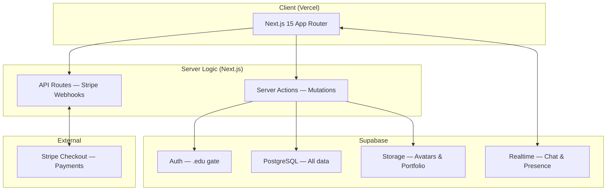

# handl — Campus Services Marketplace: Implementation Plan (Hackathon Edition)

> **Scope:** Build a fully functional, demo-ready campus marketplace in a hackathon sprint, with architecture that doesn't need to be thrown away afterward.
> **Philosophy:** Ship the critical path end-to-end first. Polish only what the judges will see. Defer everything that doesn't affect the demo — but defer it into a real plan, not a graveyard.

---

## Hackathon Demo Script (This Drives Everything)

The entire implementation is reverse-engineered from this 3-minute demo:

1. **[0:00]** Landing page loads — dark glass aesthetic, animated hero, category grid. Judges see a product, not a prototype.
2. **[0:30]** Jordan (requester) signs up with `.edu` email, gets verified badge instantly.
3. **[0:45]** Jordan browses the marketplace — filters by category, sees real listings with photos, ratings, and trust badges.
4. **[1:00]** Jordan opens Maya's (provider) profile — portfolio, stats, reviews, "Book Now" button.
5. **[1:15]** Jordan books Maya's tutoring gig — Stripe Checkout processes payment (test mode). Funds held.
6. **[1:30]** **Split screen moment:** Jordan and Maya's chat lights up in real-time via Supabase Realtime. Messages appear instantly on both sides.
7. **[2:00]** Maya marks gig complete → Jordan confirms → Review submitted → Maya's wallet balance updates.
8. **[2:15]** Quick flash of the task board — requester-initiated flow. Someone posts "Need help moving Saturday" and providers can apply.
9. **[2:30]** Dashboard view — earnings chart, completed gigs, trust score.
10. **[2:45]** Close with the value prop slide.

> [!CAUTION]
> **Every feature that isn't in this demo script is Phase 2.** No exceptions during the hackathon.

---

## System Architecture



**What's NOT in this diagram (intentionally):**
- No pgvector — Supabase `tsvector` full-text search is enough
- No OpenAI moderation — manual for now
- No Redis — Supabase Realtime handles pub/sub
- No separate backend — Next.js Server Actions are the backend

---

## Technology Stack

| Layer | Choice | Why This, Not That |
|---|---|---|
| **Framework** | Next.js 15 (App Router) | Full-stack in one project. Server Actions = no separate API. |
| **DB + Auth + Storage + Realtime** | Supabase | One service replaces 4. Free tier covers hackathon. |
| **DB Access** | `@supabase/supabase-js` client directly | ~~Prisma~~ — adds build steps, migrations, codegen. Supabase client is typed via `supabase gen types`. |
| **Styling** | Tailwind CSS + shadcn/ui | Premium-looking components in minutes, not hours. Customizable enough for Dark Glass theme. |
| **Animations** | Framer Motion (targeted) | Only 3 animations: page transitions, card hover lift, staggered grid load. |
| **Payments** | Stripe Checkout Session (NOT Connect) | Connect requires provider KYC — kills the demo flow. Checkout is one API call. Simulate provider wallet. |
| **Hosting** | Vercel | `git push` = deployed. Preview URLs for each branch. |

> [!WARNING]
> **Stripe Connect is deferred to post-hackathon.** For the demo, the requester pays via Stripe Checkout. The provider's "wallet" is a database balance column that increments when the requester confirms completion. This is a simulation — but it looks real in the demo and the architecture supports swapping in real Connect later.

---

## Database Schema (Complete — Copy-Paste Ready)

```sql
-- Run this in Supabase SQL Editor

-- ══════════════════════════════════════
-- USERS (extends Supabase auth.users)
-- ══════════════════════════════════════
create table public.profiles (
  id uuid primary key references auth.users(id) on delete cascade,
  email text not null,
  name text not null,
  avatar_url text,
  campus text not null default 'Demo University',
  class_year text,
  major text,
  bio text,
  skills text[] default '{}',
  hourly_rate decimal(10,2),
  is_available boolean default false,
  verification_tier int default 1,  -- 0=unverified, 1=.edu, 2=ID, 3=campus
  trust_score decimal(3,2) default 0.00,
  avg_rating decimal(3,2) default 0.00,
  completed_gigs int default 0,
  wallet_balance decimal(10,2) default 0.00,  -- simulated for hackathon
  created_at timestamptz default now(),
  updated_at timestamptz default now()
);

-- ══════════════════════════════════════
-- LISTINGS (provider-initiated services)
-- ══════════════════════════════════════
create type listing_category as enum (
  'tutoring', 'design', 'photography', 'coding',
  'moving', 'cleaning', 'errands', 'beauty',
  'tech_support', 'events', 'other'
);
create type listing_status as enum ('active', 'paused', 'archived');
create type pricing_type as enum ('hourly', 'fixed', 'negotiable');

create table public.listings (
  id uuid primary key default gen_random_uuid(),
  provider_id uuid not null references public.profiles(id) on delete cascade,
  title text not null,
  description text not null,
  category listing_category not null,
  tags text[] default '{}',
  pricing_type pricing_type not null default 'fixed',
  price decimal(10,2) not null,
  image_urls text[] default '{}',
  status listing_status default 'active',
  booking_count int default 0,
  avg_rating decimal(3,2) default 0.00,
  created_at timestamptz default now(),
  updated_at timestamptz default now()
);

-- ══════════════════════════════════════
-- TASK REQUESTS (requester-initiated asks)
-- ══════════════════════════════════════
create type task_status as enum ('open', 'assigned', 'in_progress', 'completed', 'cancelled');
create type urgency_level as enum ('low', 'medium', 'high', 'urgent');

create table public.task_requests (
  id uuid primary key default gen_random_uuid(),
  requester_id uuid not null references public.profiles(id) on delete cascade,
  title text not null,
  description text not null,
  category listing_category not null,
  budget_min decimal(10,2),
  budget_max decimal(10,2),
  deadline timestamptz,
  location text,
  urgency urgency_level default 'medium',
  status task_status default 'open',
  created_at timestamptz default now()
);

-- ══════════════════════════════════════
-- BOOKINGS (the transaction unit)
-- ══════════════════════════════════════
create type booking_status as enum (
  'pending', 'confirmed', 'in_progress',
  'completed', 'cancelled', 'disputed'
);

create table public.bookings (
  id uuid primary key default gen_random_uuid(),
  listing_id uuid references public.listings(id),
  task_request_id uuid references public.task_requests(id),
  provider_id uuid not null references public.profiles(id),
  requester_id uuid not null references public.profiles(id),
  agreed_price decimal(10,2) not null,
  platform_fee decimal(10,2) default 0.00,  -- calculated at booking time
  status booking_status default 'pending',
  scheduled_at timestamptz,
  completed_at timestamptz,
  created_at timestamptz default now(),
  constraint booking_has_source check (
    listing_id is not null or task_request_id is not null
  )
);

-- ══════════════════════════════════════
-- PAYMENTS (Stripe Checkout tracking)
-- ══════════════════════════════════════
create type payment_status as enum (
  'pending', 'authorized', 'captured', 'released', 'refunded', 'failed'
);

create table public.payments (
  id uuid primary key default gen_random_uuid(),
  booking_id uuid not null references public.bookings(id) on delete cascade,
  stripe_session_id text unique,
  stripe_payment_intent_id text unique,
  amount decimal(10,2) not null,
  platform_fee decimal(10,2) default 0.00,
  status payment_status default 'pending',
  created_at timestamptz default now(),
  captured_at timestamptz,
  released_at timestamptz
);

-- ══════════════════════════════════════
-- REVIEWS
-- ══════════════════════════════════════
create table public.reviews (
  id uuid primary key default gen_random_uuid(),
  booking_id uuid not null references public.bookings(id),
  reviewer_id uuid not null references public.profiles(id),
  reviewee_id uuid not null references public.profiles(id),
  rating int not null check (rating >= 1 and rating <= 5),
  comment text,
  tags text[] default '{}',  -- 'on_time', 'great_communicator', 'would_rebook'
  created_at timestamptz default now(),
  unique(booking_id, reviewer_id)  -- one review per person per booking
);

-- ══════════════════════════════════════
-- CHAT (Supabase Realtime powered)
-- ══════════════════════════════════════
create table public.conversations (
  id uuid primary key default gen_random_uuid(),
  booking_id uuid references public.bookings(id),
  created_at timestamptz default now()
);

create table public.conversation_participants (
  conversation_id uuid not null references public.conversations(id) on delete cascade,
  user_id uuid not null references public.profiles(id) on delete cascade,
  primary key (conversation_id, user_id)
);

create table public.messages (
  id uuid primary key default gen_random_uuid(),
  conversation_id uuid not null references public.conversations(id) on delete cascade,
  sender_id uuid not null references public.profiles(id),
  content text not null,
  created_at timestamptz default now()
);

-- ══════════════════════════════════════
-- INDEXES (performance-critical)
-- ══════════════════════════════════════
create index idx_listings_category on public.listings(category);
create index idx_listings_provider on public.listings(provider_id);
create index idx_listings_status on public.listings(status) where status = 'active';
create index idx_bookings_provider on public.bookings(provider_id);
create index idx_bookings_requester on public.bookings(requester_id);
create index idx_messages_conversation on public.messages(conversation_id, created_at);
create index idx_reviews_reviewee on public.reviews(reviewee_id);
create index idx_task_requests_status on public.task_requests(status) where status = 'open';

-- Full-text search on listings (no pgvector needed)
alter table public.listings add column fts tsvector
  generated always as (to_tsvector('english', coalesce(title,'') || ' ' || coalesce(description,''))) stored;
create index idx_listings_fts on public.listings using gin(fts);
```

### Schema Decisions for Hackathon

| Decision | Rationale |
|---|---|
| `wallet_balance` on `profiles` | Simulates provider earnings without Stripe Connect. A single column is enough for the demo. Replace with real Connect payouts post-hackathon. |
| `payment_status` enum tracks escrow | `authorized` → `captured` → `released` maps to the escrow concept without a double-entry ledger. |
| No RLS policies | Adds 2-3 hours of debugging. Filter in Server Actions instead. Add RLS in the first post-hackathon sprint. |
| `fts` generated column | Postgres `tsvector` gives us typo-tolerant search for free. No external search service needed. |
| `booking_has_source` constraint | Every booking must come from either a listing or a task request. Enforced at the DB level. |

---

## Design System — "Dark Glass" (Actionable Spec)

### Color Tokens
```css
:root {
  --bg-primary:     hsl(225, 25%, 6%);    /* deep space base */
  --bg-surface:     hsl(225, 20%, 10%);   /* elevated cards */
  --bg-glass:       hsla(225, 20%, 15%, 0.6); /* glass cards w/ backdrop-blur */
  --border-subtle:  hsla(225, 15%, 25%, 0.4);

  --accent-primary: hsl(195, 100%, 55%);  /* electric cyan */
  --accent-secondary: hsl(270, 80%, 65%); /* vivid purple */
  --accent-gradient: linear-gradient(135deg, var(--accent-primary), var(--accent-secondary));

  --text-primary:   hsl(0, 0%, 95%);
  --text-secondary: hsl(225, 15%, 60%);
  --text-muted:     hsl(225, 10%, 40%);

  --success: hsl(145, 65%, 50%);
  --warning: hsl(40, 95%, 55%);
  --danger:  hsl(0, 75%, 60%);

  --radius-sm: 8px;
  --radius-md: 12px;
  --radius-lg: 16px;
  --radius-full: 9999px;
}
```

### The 3 Animations That Matter (In Priority Order)
1. **Staggered grid load** — Listing cards fade-in and slide-up with 50ms stagger. First impression. Non-negotiable.
2. **Card hover lift** — `translateY(-4px)` + soft glow on the border. Makes browsing feel tactile.
3. **Page transitions** — Framer Motion `AnimatePresence` with fade + slight slide. Makes navigation feel native-app smooth.

Everything else (typing indicators, notification toasts, profile badge shimmer) is gravy. Only add if there's time left.

### Glass Card Component (The Visual Foundation)
```css
.glass-card {
  background: var(--bg-glass);
  backdrop-filter: blur(16px);
  -webkit-backdrop-filter: blur(16px);
  border: 1px solid var(--border-subtle);
  border-radius: var(--radius-lg);
  transition: transform 0.2s ease, border-color 0.2s ease;
}
.glass-card:hover {
  transform: translateY(-4px);
  border-color: var(--accent-primary);
}
```

---

## Seed Data Plan (Specific)

The demo must look like a real product with an active user base. This requires:

| Entity | Count | Details |
|---|---|---|
| **Users** | 15 | Diverse names, avatars (use generated headshots), varied class years/majors |
| **Listings** | 25-30 | 3-5 per category, with real descriptions, varied pricing, portfolio images |
| **Task Requests** | 8-10 | Mix of urgent and planned tasks |
| **Completed Bookings** | 20 | Distributed across providers to create realistic stats |
| **Reviews** | 30+ | 4-5 star distribution weighted toward 4-5, with realistic comment text |
| **Conversations** | 5 | Pre-filled with realistic back-and-forth messages |

**Key:** Two "hero" accounts must be pre-configured for the live demo:
- **Maya Chen** — Provider, CS major, 4.8★, 12 completed gigs, portfolio with design work
- **Jordan Rivera** — Requester, Freshman, 1 completed booking, newly verified

---

## Verification Plan

### Hackathon Demo Checklist
- [ ] Landing page loads in under 2 seconds on Vercel
- [ ] Auth flow: signup → `.edu` validation → redirect to dashboard (under 10 seconds)
- [ ] Browse page: listings render with images, ratings, category filters work
- [ ] Booking flow: select listing → Stripe Checkout → payment success → booking created
- [ ] Chat: open two browser tabs, send message, see it appear on the other tab instantly
- [ ] Completion flow: mark complete → confirm → review form → wallet balance updates
- [ ] Task board: can post a task request, see it in the public feed
- [ ] Mobile responsive: entire demo flow works on phone-width viewport

### Post-Hackathon Hardening (Week 1)
- [ ] Add RLS policies to all tables
- [ ] Swap simulated wallet for Stripe Connect Express
- [ ] Add OpenAI content moderation on listing/profile creation
- [ ] Implement double-blind review reveal logic
- [ ] Add proper error boundaries and loading states
- [ ] Set up Sentry for error monitoring

### Post-Hackathon Growth (Weeks 2-4)
- [ ] Stripe Identity for ID verification tier
- [ ] Dispute resolution workflow
- [ ] Personal analytics dashboard with charts
- [ ] Referral system with completion-gated rewards
- [ ] Campus insights dashboard (anonymized aggregate data)
- [ ] React Native (Expo) mobile app
